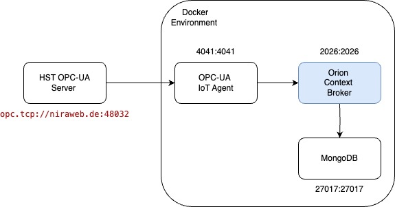

# waterverse-opc-ua-iot-agent

This set up is used to configure the interaction between an OPC-UA server with an OPC-UA client 

The configuration of the connection to the HST server is in the docker-compose file under the iot-agent service in the environment variables. 

## Architecture used for this set up is the following 



## Running the services

```
cd docker 
docker-compose up 
````

To debug the iot agent, use the following command: 

```
docker exec -it <service-image-id> bash
```

The `certificates` folder has the trsuted and rejected certificates. 


